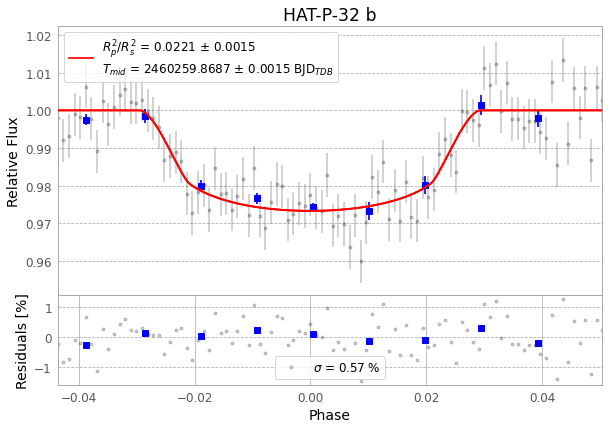
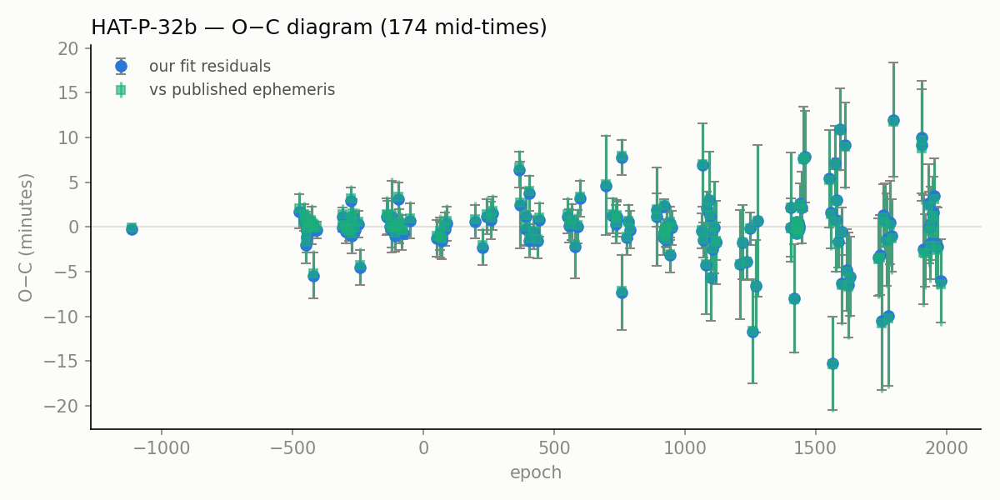

# Backyard Meridian

Automated citizen science with human judgment, from a small telescope and a Mac
mini in Berlin.

**Live site: https://contactabhishekbasu.github.io/night-theater/**

[Case study](https://contactabhishekbasu.github.io/night-theater/) ·
[Workflow](https://contactabhishekbasu.github.io/night-theater/status/) ·
[Review](https://contactabhishekbasu.github.io/night-theater/review/) ·
[Evaluation](https://contactabhishekbasu.github.io/night-theater/eval/)

## What it is

A pipeline that turns public telescope archives and my own night captures into
astronomy measurements you can check. Software does the repetitive work:
finding data, downloading, reducing, measuring, bookkeeping. A human makes
every scientific call. Nothing goes to a science database without a person
approving it.

## How it makes an impact

Exoplanet clocks drift. A planet's published transit times slowly go stale,
and the big telescopes can't re-check thousands of them. Networks like NASA
Exoplanet Watch and ExoClock depend on small telescopes re-measuring known
transits so the predictions stay fresh. This project contributes reduced
transit measurements and timing residuals, and it flags planets whose clocks
look genuinely odd (a decaying orbit, an unexplained wobble) for human
follow-up. Every measurement traces back to the raw frames that produced it.

## The product problem

One person cannot reduce thousands of archive nights by hand, and full
automation cannot be trusted with scientific judgment. So the design rule is:
automate the reduction, never the judgment. The pipeline runs unattended for
days, probing archives, reducing nights, scoring results. The few decisions
that matter (approve a result, promote a model, submit a measurement) land in
a small human review queue.

## Methodology

Every night of data is judged the same way. Reduce the raw frames, fit the
transit, then compare the fit to published values: planet-to-star radius
ratio, transit duration, and mid-time against the catalog ephemeris. A night
is ACCURATE when all three land within 2 sigma of publication, with error
bars inflated honestly for correlated noise. That comparison is the verdict.
A model's opinion never is.

## One night, start to finish

HAT-P-32 b on the night of 2023-11-10, from the MicroObservatory archive. The
pipeline probed the archive, found 98 usable frames, reduced them with EXOTIC,
fit the transit, and scored the result against publication. Verdict:
**ACCURATE**.

*The fitted light curve. Grey points are single frames, blue points are binned,
and the red line is the fitted transit model. The star dims by about 2.2% while
the planet crosses it, then recovers. Residual scatter is 0.57%.*

How the night scored against published values:

| Check | Result | Reading |
|---|---|---|
| Transit depth | 0.04 sigma from publication | matches the known planet size almost exactly |
| Duration | 1.35 sigma from publication | consistent with the known geometry |
| Mid-time | 0.6 min early, 0.29 sigma | the clock still runs on time |
| Detection strength | depth measured at 29 sigma | unambiguous transit |

The mid-time then joins every other measurement of this planet (TESS,
literature, community observers) in one timing series:

*Observed minus calculated mid-times for HAT-P-32 b, 173 measurements. A flat
line around zero means the published ephemeris still predicts reality. This
night is one point in that line. The same machinery reproduces WASP-12 b's
known orbital decay, which is the pipeline's built-in sanity check.*

The full dossier for this night, with uncertainties, diagnostics, and
provenance, is in the
[Review queue](https://contactabhishekbasu.github.io/night-theater/review/).

## Pipeline

1. Find: two independent catalogs (the AAVSO observation database and the DIY
   Planet Search community index) say which archive nights contain a transit.
2. Probe: a cheap check confirms frames really exist before spending time.
3. Fetch and reduce: frames are downloaded and reduced with EXOTIC, the NASA
   Exoplanet Watch tool.
4. Score: the fit is compared to published values and gets a verdict.
5. Record: every run writes a tamper-evident record of inputs, code version,
   outputs, and a hash-chained audit log.
6. Repeat: a supervisor keeps the loop running unattended. Models retrain
   daily, ephemerides re-fit weekly, and a human works the review queue.

## Validation

Verdicts are comparisons to peer-reviewed values, never self-grading. Fits
are cross-checked with a second, unrelated fitter, and timing series merge
TESS data, literature measurements, and community observations. There is also
a physics anchor: the ephemeris watch reproduces WASP-12 b's known orbital
decay at high significance. If that signal ever disappears, the pipeline is
wrong, not the planet. Fixed seeds, frozen dataset hashes, and append-only
history files mean any number on the dashboard can be regenerated.

## The models

Two models, and neither is ever the judge.

The **grader** works after reduction. It estimates whether a finished
reduction is science-grade so the review queue can be ordered sensibly. It is
a gradient-boosted tree model, retrained daily as a watchdog. Simple
transparent rules remain the authoritative grader until a model earns
promotion. Its features are light-curve quality: scatter, depth
signal-to-noise, red noise, coverage.

The **probing model** works before observation. It estimates whether a night
is worth attempting, in two stages: will frames exist (an empirical rate
table) times will the fit be accurate (a regularized logistic regression). It
runs shadow-only. Predictions are logged; nothing is steered. It sees only
what is knowable before observing: geometry, moon, season, target history.
Anything derived from the answer is banned as leakage.

Model operations are deliberately boring. Every training cycle is versioned,
hashed, and logged with its dataset fingerprint. Training never promotes.
Promotion and demotion are human acts recorded in an audit log. The previous
champion was demoted when its advantage failed to reproduce, and the
transparent rules took back authority.

Evaluation is pre-registered and hard on the models on purpose: grouped
cross-validation with whole targets held out, confidence intervals from
resampling whole targets, and a paired promotion gate. A model becomes
promotable only when its improvement over the rules baseline clears zero
across three consecutive growing-data cycles, and then only with a human
sign-off. The current honest state: the probing model's improvement does not
yet clear the gate. The
[Evaluation page](https://contactabhishekbasu.github.io/night-theater/eval/)
shows all of it.

## Review (under development)

The [Review page](https://contactabhishekbasu.github.io/night-theater/review/)
is the human side: a queue of reduced nights with light curves, quality
checklists, and a representative frame from each night. Twenty worked
examples, chosen to show the range of outcomes rather than the best ones,
give a cross-section of what the pipeline produces. A person approves,
rejects, or flags each result. Approved results move to the submission
pipeline, which is also human-gated. Still evolving: richer triage lanes and
ephemeris-watch flags feeding the queue.

---

This site is a static snapshot, refreshed by automation from a private source
pipeline. Methods are documented in the per-run dossiers and on the
Evaluation page, and everything here is reproducible from the recorded
provenance.
